# 项目文档--JPA查询Demo

## 实验要求

- 对一张表进行CRUD操作==（后面学了多表关联要改进为多表查询）==
- 具备Restful风格的CRUD
- 具备分页排序功能
- 具备动态条件查询功能


## 基本知识


## 1、项目搭建

### 1、环境

- **jdk** 1.8
- **SpringBoot** 2.2.0以上版本
- **maven**
- **mysql** 8.0
- **navicat premium 12**
- **bootstrap** v4.5
- **thymeleaf** 3.0以上版本
- **jquery** 3.5.1
- 工具：**IDEA**、**HBuilder**


### 2、实体设计

Employee（员工）

| 属性      | 类型    |
| --------- | ------- |
| empNo     | Integer |
| empName   | String  |
| gender    | String  |
| age       | Integer |
| birth     | Date    |
| education | String  |
| email     | String  |

> Education（教育经历） 小学/初中/高中/专科/大学本科/研究生/博士/博士后/其他
>


### 3、搭建后端开发环境

#### 1、创建项目，引入依赖


引入相关依赖：

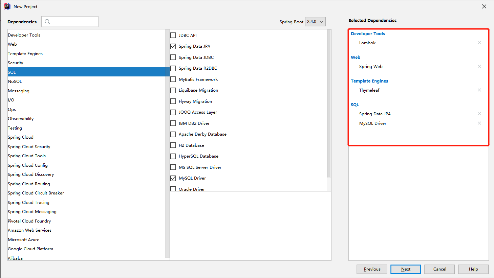


目录结构如下：

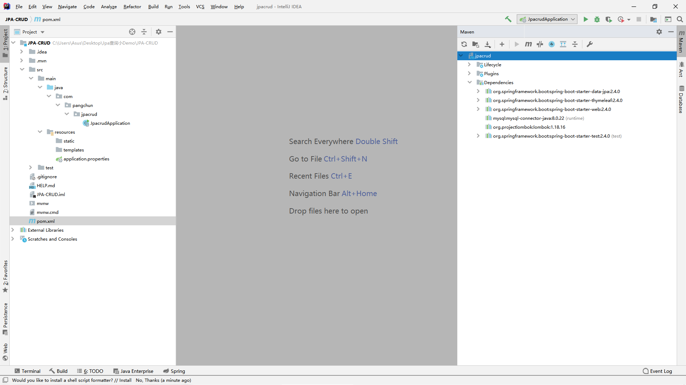


#### 2、配置数据库连接等配置文件


```properties
spring.datasource.driver-class-name=com.mysql.cj.jdbc.Driver
spring.datasource.url=jdbc:mysql://127.0.0.1:3306/db_jpacrud?useUnicode=true&serverTimezone=UTC&useSSL=false
spring.datasource.username=****
spring.datasource.password=****

#更改项目端口号
server.port=80

#修改项目路径
server.servlet.context-path=/crud

#创建数据库的方式类型
spring.jpa.hibernate.ddl-auto=update

#显示sql语句
spring.jpa.show-sql=true

#修改日志级别
logging.level.com.pangchun=trace
#自定义日志格式
logging.pattern.console=%d{HH:mm} [%thread] %-5level %logger{36} - %msg%n

#关闭thymeleaf的缓存
spring.thymeleaf.cache=false

#开启hiddenmethod配置，不然form表单提交不了put和delete的mothod
spring.mvc.hiddenmethod.filter.enabled=true

#关闭OpenEntityManagerInViewInterceptor，不然日志会警告
spring.jpa.open-in-view=false
```


#### 3、新建数据库

> 只需要建数据库，不需要建表；jpa会帮我们建表；

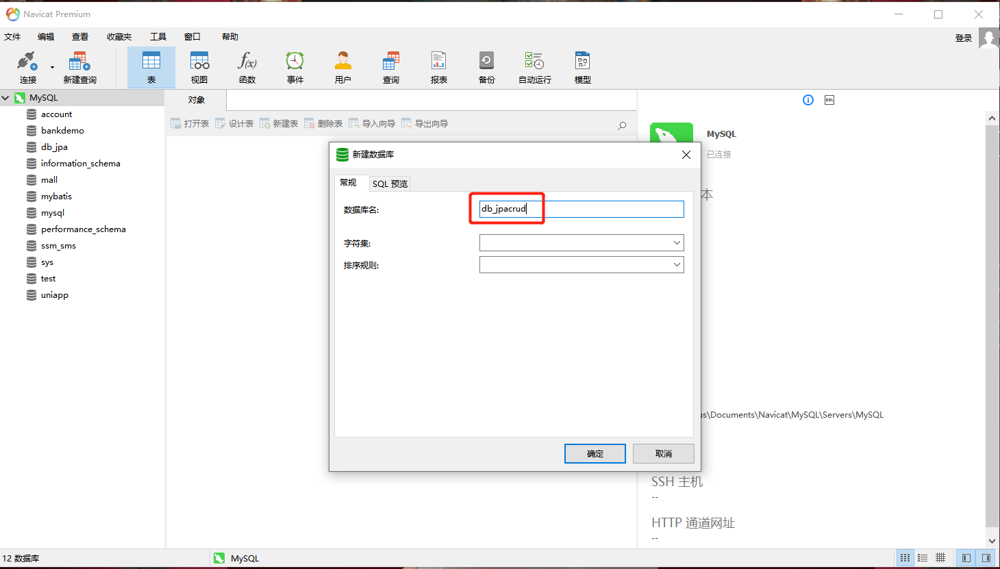


#### 4、新建HelloController测试项目


```java
@RestController
public class HelloController {

    @RequestMapping("/hello")
    public String Hello(){
        return "Hello";
    }
}
```

测试运行：http://localhost/crud/hello


项目成功启动！

### 4、搭建前端开发环境

> 下载bootstrap和JQuery包，创建开发文件夹即可进行前端页面开发；
>
> 主要是引入这几个文件，因为是小demo，不需要引入所有css和js文件；
>
> - bootstrap.css
> - bootstrap.js
> - jquery-3.4.1.js

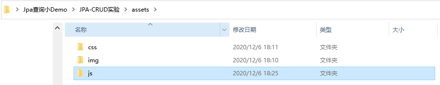

## 2、前端开发

员工列表页面：


```html
<!DOCTYPE html>
<html>
	<head>
		<meta charset="utf-8">
		<title></title>
		<link rel="stylesheet" type="text/css" href="assets/css/bootstrap.css" />
		<style type="text/css">
			body {
				background-color: #CCCCCC;
			}

			.table {
				font-size: 20px;
			}

			tbody>tr {
				background-color: #FFFFFF;
			}
		</style>
	</head>
	<body>
		<div>
			<main>
				<!-- 搜索 -->
				<div class="row" style="margin: 50px 0;">
					<div class="offset-1 col-10">
						<form class="form-inline" style="font-size: 20px;">
							<div class="form-group mx-sm-3 mb-2">
								<label>员工编号：</label>
								<input type="text" class="form-control" placeholder="请输入">
							</div>
							<div class="form-group mx-sm-3 mb-2">
								<label>员工姓名：</label>
								<input type="text" class="form-control" placeholder="请输入">
							</div>
							<div class="form-group mx-sm-3 mb-2">
								<label for="inputPassword2">员工性别：</label>
								<select class="form-control">
									<option selected disabled>--请选择--</option>
									<option>男</option>
									<option>女</option>
								</select>
							</div>
							<div class="form-group mx-sm-3 mb-2">
								<label>员工年龄：</label>
								<input type="number" class="form-control" placeholder="请输入">
							</div>
							<div class="form-group mx-sm-3 mb-2">
								<label>出生日期：</label>
								<input type="date" class="form-control" placeholder="请输入">
							</div>
							<div class="form-group mx-sm-3 mb-2">
								<label>教育经历：</label>
								<select class="form-control">
									<option selected disabled>--请选择--</option>
									<option value="">小学</option>
									<option value="">初中</option>
									<option value="">高中</option>
									<option value="">专科</option>
									<option value="">大学本科</option>
									<option value="">研究生</option>
									<option value="">博士</option>
									<option value="">博士后</option>
									<option value="">其他</option>
								</select>
							</div>
							<div class="form-group mx-sm-3 mb-2">
								<label>员工邮箱：</label>
								<input type="email" class="form-control" placeholder="请输入">
							</div>

							<button style="margin-left: 118px;" type="submit" class="btn btn-primary btn-md mb-2">开始查询</button>
							<button style="margin-left: 16px;" type="submit" class="btn btn-warning btn-md mb-2">重置条件</button>

						</form>
					</div>
				</div>

				<!-- list -->
				<div class="row">
					<div class="offset-1 col-10">
						<h3><a class="btn btn-success btn-lg">添加员工</a></h3>
						<table class="table">
							<thead class="thead-dark">
								<tr>
									<th scope="col">员工编号</th>
									<th scope="col">员工姓名</th>
									<th scope="col">员工性别</th>
									<th scope="col">员工年龄</th>
									<th scope="col">出生日期</th>
									<th scope="col">教育经历</th>
									<th scope="col">员工邮箱</th>
									<th scope="col">操作</th>
								</tr>
							</thead>
							<tbody>
								<tr>
									<th>1001</th>
									<td>张三</td>
									<td>男</td>
									<td>23</td>
									<td>1997/12/29</td>
									<td>大学本科</td>
									<td>zhangSan@mail.com</td>
									<td>
										<a class="btn btn-primary">编辑</a>
										<a class="btn btn-danger">删除</a>
									</td>
								</tr>
								<tr>
									<th>1001</th>
									<td>张三</td>
									<td>男</td>
									<td>23</td>
									<td>1997/12/29</td>
									<td>大学本科</td>
									<td>zhangSan@mail.com</td>
									<td>
										<a class="btn btn-primary">编辑</a>
										<a class="btn btn-danger">删除</a>
									</td>
								</tr>
								<tr>
									<th>1001</th>
									<td>张三</td>
									<td>男</td>
									<td>23</td>
									<td>1997/12/29</td>
									<td>大学本科</td>
									<td>zhangSan@mail.com</td>
									<td>
										<a class="btn btn-primary">编辑</a>
										<a class="btn btn-danger">删除</a>
									</td>
								</tr>
								<tr>
									<th>1001</th>
									<td>张三</td>
									<td>男</td>
									<td>23</td>
									<td>1997/12/29</td>
									<td>大学本科</td>
									<td>zhangSan@mail.com</td>
									<td>
										<a class="btn btn-primary">编辑</a>
										<a class="btn btn-danger">删除</a>
									</td>
								</tr>
								<tr>
									<th>1001</th>
									<td>张三</td>
									<td>男</td>
									<td>23</td>
									<td>1997/12/29</td>
									<td>大学本科</td>
									<td>zhangSan@mail.com</td>
									<td>
										<a class="btn btn-primary">编辑</a>
										<a class="btn btn-danger">删除</a>
									</td>
								</tr>
								<tr>
									<th>1001</th>
									<td>张三</td>
									<td>男</td>
									<td>23</td>
									<td>1997/12/29</td>
									<td>大学本科</td>
									<td>zhangSan@mail.com</td>
									<td>
										<a class="btn btn-primary">编辑</a>
										<a class="btn btn-danger">删除</a>
									</td>
								</tr>
								<tr>
									<th>1001</th>
									<td>张三</td>
									<td>男</td>
									<td>23</td>
									<td>1997/12/29</td>
									<td>大学本科</td>
									<td>zhangSan@mail.com</td>
									<td>
										<a class="btn btn-primary">编辑</a>
										<a class="btn btn-danger">删除</a>
									</td>
								</tr>
								<tr>
									<th>1001</th>
									<td>张三</td>
									<td>男</td>
									<td>23</td>
									<td>1997/12/29</td>
									<td>大学本科</td>
									<td>zhangSan@mail.com</td>
									<td>
										<a class="btn btn-primary">编辑</a>
										<a class="btn btn-danger">删除</a>
									</td>
								</tr>


							</tbody>
						</table>
					</div>
				</div>

				<!-- 分页 -->
				<div class="row">
					<div class="offset-5 col-7">
						<nav aria-label="Page navigation example">
							<ul class="pagination pagination-lg">
								<li class="page-item">
									<a class="page-link" href="#" aria-label="Previous">
										<span aria-hidden="true">&laquo;</span>
									</a>
								</li>
								<li class="page-item"><a class="page-link" href="#">1</a></li>
								<li class="page-item"><a class="page-link" href="#">2</a></li>
								<li class="page-item"><a class="page-link" href="#">3</a></li>
								<li class="page-item">
									<a class="page-link" href="#" aria-label="Next">
										<span aria-hidden="true">&raquo;</span>
									</a>
								</li>
							</ul>
						</nav>
					</div>
				</div>
			</main>
		</div>

		<!-- js引入 -->
		<script src="assets/js/jquery-3.4.1.js"></script>
		<script src="assets/js/bootstrap.js"></script>
	</body>
</html>
```

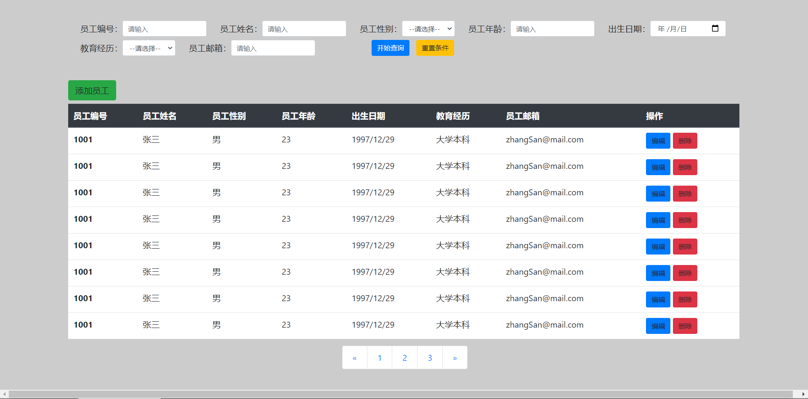


员工添加/编辑页面：（添加和编辑页面可以二合一）


```html
<!DOCTYPE html>
<html>
	<head>
		<meta charset="utf-8">
		<title></title>
		<link rel="stylesheet" type="text/css" href="assets/css/bootstrap.css" />

	</head>
	<body>
		<main>
			<div class="row">
				<div class="offset-3 col-8">
					<div class="w-75 p-3" style="background-color: #eee;margin-top: 50px;">
						<h2 style="color: #007BFF;">新增员工</h2>
						<form class="form" style="font-size: 20px;">

							<!-- 新增员工，编号自动生成；修改员工，需要回显员工编号； -->
							<div class="form-group mx-sm-3 mb-2">
								<label>员工编号：</label>
								<input type="text" class="form-control" placeholder="请输入">
							</div>

							<div class="form-group mx-sm-3 mb-2">
								<label>员工姓名：</label>
								<input type="text" class="form-control" placeholder="请输入">
							</div>
							<div class="form-group mx-sm-3 mb-2">
								<label for="inputPassword2">员工性别：</label>
								<select class="form-control">
									<option selected disabled>--请选择--</option>
									<option>男</option>
									<option>女</option>
								</select>
							</div>
							<div class="form-group mx-sm-3 mb-2">
								<label>员工年龄：</label>
								<input type="number" class="form-control" placeholder="请输入">
							</div>
							<div class="form-group mx-sm-3 mb-2">
								<label>出生日期：</label>
								<input type="date" class="form-control" placeholder="请输入">
							</div>
							<div class="form-group mx-sm-3 mb-2">
								<label>教育经历：</label>
								<select class="form-control">
									<option selected disabled>--请选择--</option>
									<option value="">小学</option>
									<option value="">初中</option>
									<option value="">高中</option>
									<option value="">专科</option>
									<option value="">大学本科</option>
									<option value="">研究生</option>
									<option value="">博士</option>
									<option value="">博士后</option>
									<option value="">其他</option>
								</select>
							</div>
							<div class="form-group mx-sm-3 mb-2">
								<label>员工邮箱：</label>
								<input type="email" class="form-control" placeholder="请输入">
							</div>

							<div>
								<button style="margin-left: 42%;position: relative;" type="submit" class="btn btn-primary btn-md mb-2">提交</button>
								<button type="reset" class="btn btn-primary btn-md mb-2">取消</button>
							</div>

						</form>

					</div>

				</div>
			</div>

		</main>

		<!-- js引入 -->
		<script src="assets/js/jquery-3.4.1.js"></script>
		<script src="assets/js/bootstrap.js"></script>
	</body>
</html>
```

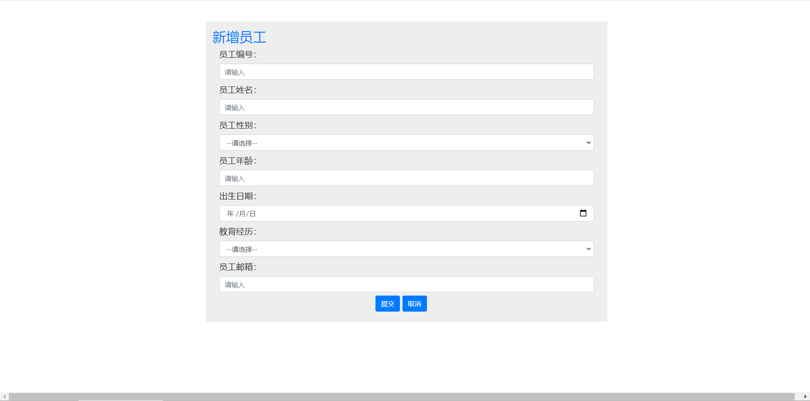


## 3、后端开发

### 1、引入静态资源

把前端开发好的资源放到对应文件夹里；

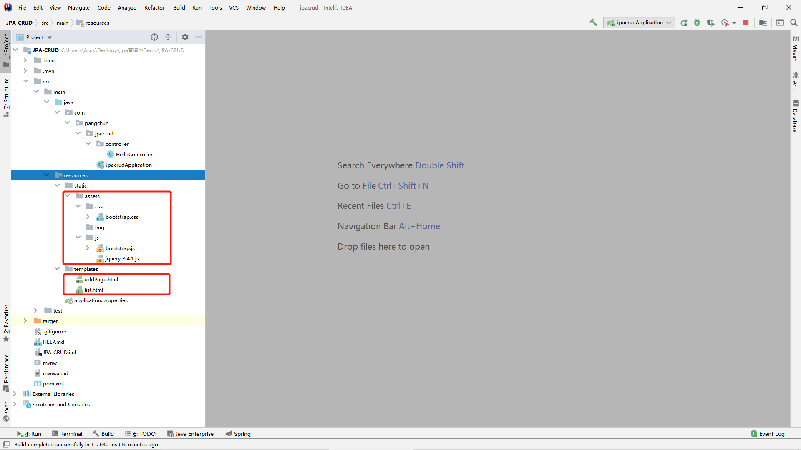


新建EmpController，测试进入主页面；http://localhost/crud/list

```java
@Controller
public class EmpController {

    @RequestMapping("/list")
    public String toListPage() {
        return "list";
    }
}
```


### 2、修改静态资源链接

引入thymeleaf命名规则：

```html
<html xmlns:th="http://www.thymeleaf.org">
```

修改为thymeleaf语法的链接：

```html
<link th:href="@{/assets/css/bootstrap.css}" rel="stylesheet" type="text/css" href="assets/css/bootstrap.css" />

<script th:src="@{/assets/js/jquery-3.4.1.js}" src="assets/js/jquery-3.4.1.js"></script>
<script th:src="@{/assets/js/bootstrap.js}" src="assets/js/bootstrap.js"></script>
```


### 3、造一些员工数据

```java
@Data
@Entity
public class Employee {
    @Id
    @GeneratedValue(strategy = GenerationType.IDENTITY)
    private Integer empNo;
    private String empName;
    private String gender;
    private Integer age;
    private Date birth;
    private String education;
    private String email;
}
```

```java
public interface EmpRepository extends CrudRepository<Employee,Integer> {
}
```

```java
@SpringBootTest
class JpacrudApplicationTests {

    @Autowired
    EmpRepository empRepository;

    @Test
    void contextLoads() {
        Date date = new Date();
        List list = new ArrayList<Employee>();
        for (int i = 0; i <24 ; i++) {
            Employee employee = new Employee();
            employee.setEmpNo(i);
            employee.setEmpName("张三"+i);
            employee.setGender("男");
            employee.setAge(21);
            employee.setBirth(date);
            employee.setEducation("大学本科");
            employee.setEmail("zhangSan@mail.com");
            list.add(employee);
        }
        empRepository.saveAll(list);
    }
}
```

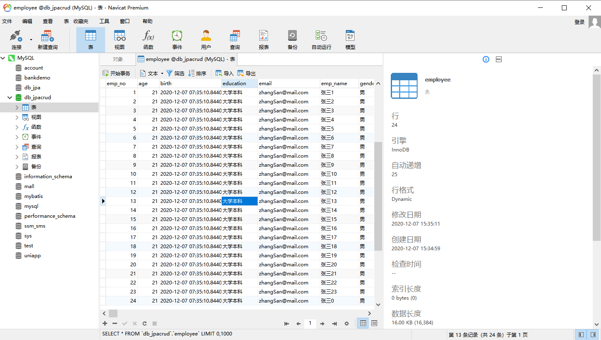


### 4、开发分页查询功能

> - 分页的按钮应该根据数据条数生成，不能写死
> - 进入首页默认查询出第一页的数据
> - 使用thymeleaf的工具类${#numbers.sequence(from,to)} 来动态生成页码数
>
> ```html
> th:each="pageNum:${#numbers.sequence(0,pageInfo.totalPages)}"
> ```
>
> - 使用restful风格，因此不要使用@RequestMapping；


#### 1、进入首页，查询出第一页的数据

因为有分页，我们需要拿到分页数据，因此创建一个PageInfo的bean来接收和设置参数：

```java
@Data
public class PageInfo {
    private Integer pageNum;
    private Integer pageSize;
    private Integer totalPages;
    private Integer totalRecords;
}
```


写一个controller完成登录跳转：http://localhost/crud/list

```java
@Controller
public class EmpController {

    @RequestMapping("/list")
    public String toListPage() {
        
        return "list";
    }
}
```


自定义数据访问层操作数据库，继承PagingAndSortingRepository接口：

```java
public interface EmpRepository extends CrudRepository<Employee,Integer>, PagingAndSortingRepository<Employee,Integer> {
}
```


用jpa查询出分页的信息放进PageInfo，查出第一页的员工数据放入list，最后将两个数据都放进model中返回给前端页面：

```java
 @Autowired
    EmpRepository empRepository;

@GetMapping("/list")
    public String toListPage(Model model) {
        PageInfo pageInfo =  new PageInfo();
        pageInfo.setPageNum(0);
        pageInfo.setPageSize(8);

        Pageable pageable = PageRequest.of(pageInfo.getPageNum(),pageInfo.getPageSize());
        Page<Employee> page = empRepository.findAll(pageable);

        pageInfo.setTotalRecords((int) page.getTotalElements());//数据总条数
        pageInfo.setTotalPages(page.getTotalPages());//总页数
        List<Employee> employeeList = page.getContent();//所有员工列表

        for (Employee employee : employeeList) {
            System.out.println(employee);
        }

        model.addAttribute("pageInfo",pageInfo);
        model.addAttribute("employeeList",employeeList);
        return "list";
    }
```

这样我们在前端通过`${}`就能拿到model域的对象了；


用`th:each`标签遍历员工数据：

```html
<tr th:each="employee:${employeeList}">
    <th th:text="${employee.empNo}"></th>
    <th th:text="${employee.empName}"></th>
    <th th:text="${employee.gender}"></th>
    <th th:text="${employee.age}"></th>
    <th th:text="${employee.birth}"></th>
    <th th:text="${employee.education}"></th>
    <th th:text="${employee.email}"></th>
    <td>
        <a class="btn btn-primary">编辑</a>
        <a class="btn btn-danger">删除</a>
    </td>
</tr>
```


我们的分页的页数按钮是动态生成的，我们从后端拿到总页数，通过thymeleaf的工具类#numbers`${#numbers.sequence(from,to)} `来将总页码数变成一个Integer数组，然后再用`th:each`遍历该数组即可动态生成页码按钮；《[sequence方法的使用](https://www.jb51.net/article/12174.htm)》

```html
<nav aria-label="Page navigation example">
    <ul class="pagination pagination-lg">
        <li class="page-item">
            <a class="page-link" href="#" aria-label="Previous">
                <span aria-hidden="true">&laquo;</span>
            </a>
        </li>
        <li class="page-item" th:each="pageNum:${#numbers.sequence(0,(pageInfo.totalPages)-1)}">
            <a th:text="${pageNum+1}" class="page-link" href="#"></a>
        </li>
        <li class="page-item">
            <a class="page-link" href="#" aria-label="Next">
                <span aria-hidden="true">&raquo;</span>
            </a>
        </li>
    </ul>
</nav>
```


运行项目测试：

可以看到查出的是数据库的前8条数据；

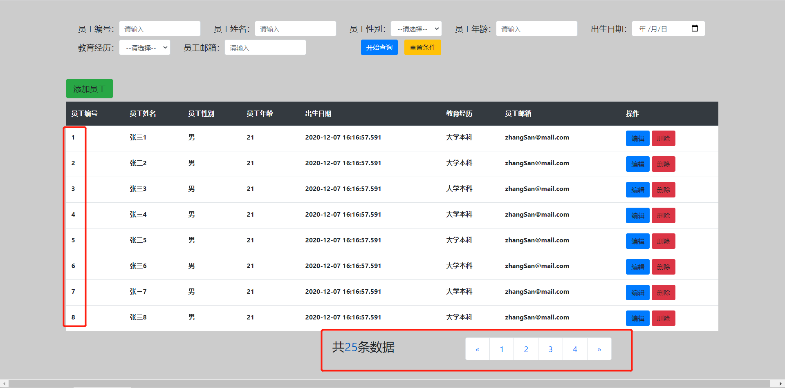


#### 2、点击页数按钮，查询相应页数的员工数据

> - 取到当前页码，判断是不是首页/最后一页，若是，禁用当前按钮；若非，查询下一页数据；
> - 停留在当前页的时候要禁用当前页码的按钮：思路>>>判断返回的分页信息中的当前页码是否等于前端选中的页码

```html
<nav aria-label="Page navigation example">
    <ul class="pagination pagination-lg">
        <li class="page-item" th:class="${pageInfo.pageNum==0}?'page-item disabled':'page-item'">
            <a th:href="@{/list/}+${pageInfo.pageNum-1}" class="page-link"  href="#" aria-label="Previous">
                <span aria-hidden="true">&laquo;</span>
            </a>
        </li>
        <li th:class="${pageInfo.pageNum==pageNum}?'page-item disabled':'page-item'" class="page-item" th:each="pageNum:${#numbers.sequence(0,(pageInfo.totalPages)-1)}">
            <a th:text="${pageNum+1}" class="page-link" th:href="@{/list/}+${pageNum}" href="#"></a>
        </li>
        <li class="page-item" th:class="${pageInfo.pageNum}==(${pageInfo.totalPages}-1)?'page-item disabled':'page-item'">
            <a th:href="@{/list/}+${pageInfo.pageNum+1}" class="page-link" href="#" aria-label="Next">
                <span aria-hidden="true">&raquo;</span>
            </a>
        </li>
    </ul>
</nav>
```


### 5、开发动态查询功能

> 提交表单，后台进行复杂查询，返回员工list给前端；
>
> - 员工编号是精确查询
> - 姓名是模糊查询
> - 教育经历是精确查询


第一步：修改前端搜索表单页面，因为搜索条件大多类似，所以将搜索条件简化了一些

```html
<form th:action="@{/list/specQuery}" action="/specQuery" method="get" class="form-inline" style="font-size: 20px;" >
    <div class="form-group mx-sm-3 mb-2">
        <label>员工编号：</label>
        <input name="empNo" type="text" class="form-control" placeholder="请输入">
    </div>
    <div class="form-group mx-sm-3 mb-2">
        <label>员工姓名：</label>
        <input name="empName" type="text" class="form-control" placeholder="请输入">
    </div>

    <div class="form-group mx-sm-3 mb-2">
        <label>教育经历：</label>
        <select name="education" class="form-control">
            <option selected disabled>--请选择--</option>
            <option value="小学">小学</option>
            <option value="初中">初中</option>
            <option value="高中">高中</option>
            <option value="专科">专科</option>
            <option value="大学本科">大学本科</option>
            <option value="研究生">研究生</option>
            <option value="博士">博士</option>
            <option value="博士后">博士后</option>
            <option value="其他">其他</option>
        </select>
    </div>

    <button style="margin-left: 118px;" type="submit" class="btn btn-primary btn-md mb-2">开始查询</button>
    <button style="margin-left: 16px;" type="reset" class="btn btn-warning btn-md mb-2">重置条件</button>

</form>


<!--如果没有员工数据就不显示-->
    <tr  th:if="${employeeList!=null}" th:each="employee:${employeeList}">

<!-- 分页 -->
<!--如果是动态条件查询就将分页隐藏-->
<div class="row"  th:if="${pageInfo!=null}">
```


第二步、创建controller完成页面跳转

```java
@GetMapping("/list/specQuery")
public String specQuery(Employee employee){
    System.out.println("123");
    return "redirect:/list";
}
```


第三步、编写复杂查询代码


复杂查询需要继承JpaSpecificationExecutor接口：

```java
public interface EmpRepository extends
        CrudRepository<Employee,Integer>,
        PagingAndSortingRepository<Employee,Integer>,
        JpaSpecificationExecutor<Employee> {
}
```


```java
@GetMapping("/list/specQuery")
    public String specQuery(Employee employee,Model model){
        PageInfo pageInfo =  new PageInfo();
        pageInfo.setPageNum(0);
        pageInfo.setPageSize(8);
        Pageable pageable = PageRequest.of(pageInfo.getPageNum(),pageInfo.getPageSize());


        List<Employee> employeeList = empRepository.findAll(new Specification<Employee>() {
            @Override
            public Predicate toPredicate(Root<Employee> root, CriteriaQuery<?> query, CriteriaBuilder cb) {

                Predicate predicate = cb.conjunction();

                if (!ObjectUtils.isEmpty(employee)) {
                    if (!ObjectUtils.isEmpty(employee.getEmpNo()))
                        predicate.getExpressions().add(cb.equal(root.get("empNo"), employee.getEmpNo()));
                    if (!ObjectUtils.isEmpty(employee.getEmpName()))
                        predicate.getExpressions().add(cb.like(root.get("empName"), "%" + employee.getEmpName() + "%"));
                    if (!ObjectUtils.isEmpty(employee.getEducation()))
                        predicate.getExpressions().add(cb.equal(root.get("education"), employee.getEducation()));
                }

                return predicate;
            }
        });

        model.addAttribute("employeeList",employeeList);
        return "list";
    }
```


### 6、开发添加员工功能


> 思路：点击添加按钮，进入添加页面，提交表单，后台返回员工list到list.html页面
>
> - post请求


先将新增页的员工编号注释掉，因为jpa在新增的时候只要不指定主键，默认是新增；

修改前端页面

```html
<form th:action="@{/emp}" method="post" class="form" style="font-size: 20px;">

    <!-- 新增员工，编号自动生成；修改员工，需要回显员工编号； -->
    <!--
    <div class="form-group mx-sm-3 mb-2">
        <label>员工编号：</label>
        <input name="empNo" type="text" class="form-control" placeholder="请输入">
    </div>
-->
    <div class="form-group mx-sm-3 mb-2">
        <label>员工姓名：</label>
        <input name="empName" type="text" class="form-control" placeholder="请输入">
    </div>
    <div class="form-group mx-sm-3 mb-2">
        <label>员工性别：</label>
        <select name="gender" class="form-control">
            <option selected disabled>--请选择--</option>
            <option value="男">男</option>
            <option value="女">女</option>
        </select>
    </div>
    <div class="form-group mx-sm-3 mb-2">
        <label>员工年龄：</label>
        <input name="age" type="number" class="form-control" placeholder="请输入">
    </div>
    <div class="form-group mx-sm-3 mb-2">
        <label>出生日期：</label>
        <input name="birth" type="date" class="form-control" placeholder="请输入">
    </div>
    <div class="form-group mx-sm-3 mb-2">
        <label>教育经历：</label>
        <select name="education" class="form-control">
            <option selected disabled>--请选择--</option>
            <option value="小学">小学</option>
            <option value="初中">初中</option>
            <option value="高中">高中</option>
            <option value="专科">专科</option>
            <option value="大学本科">大学本科</option>
            <option value="研究生">研究生</option>
            <option value="博士">博士</option>
            <option value="博士后">博士后</option>
            <option value="其他">其他</option>
        </select>
    </div>
    <div class="form-group mx-sm-3 mb-2">
        <label>员工邮箱：</label>
        <input name="email" type="email" class="form-control" placeholder="请输入">
    </div>

    <div>
        <button style="margin-left: 42%;position: relative;" type="submit" class="btn btn-primary btn-md mb-2">提交</button>
        <a th:href="@{/list}" class="btn btn-primary btn-md mb-2">取消</a>
    </div>

</form>
```


编写后端接口

```java
@GetMapping("/emp")
public String toAddPage(){
    return "addPage";
}

@PostMapping("/emp")
public String addEmp(Employee employee){

   // System.out.println(employee);

    empRepository.save(employee);

    return "redirect:/list";
}
```


### 7、开发编辑员工功能

> 不难发现，编辑和新增页面只差一个员工编号的回显，因此可以重用这两个页面；
>
> 编辑需要对编辑的员工信息进行回显，进入编辑页面应看见员工的所有信息，因此需要控制若为新增时，不显示信息；而我们可以在页面跳转的时候从后端拿到指定id的员工信息，那么在model域中有一个员工employee，下面来修改页面：

给编辑按钮添加链接：

```html
<a class="btn btn-primary" th:href="@{/emp/}+${employee.empNo}">编辑</a>
```

先控制页面跳转，在model域中放入一个员工

```java
@GetMapping("/emp/{empNo}")
public String toEditPage(@PathVariable("empNo") Integer empNo,Model model){

    Optional<Employee> employeeOptional = empRepository.findById(empNo);
    Employee employee = employeeOptional.get();

    model.addAttribute("employee",employee);

    //System.out.println(employee);

    return "addPage";
}
```


完成页面信息回显

```html
<!-- 新增员工，编号自动生成；修改员工，需要回显员工编号；但是员工编号不能修改 -->
<div class="form-group mx-sm-3 mb-2" th:if="${employee!=null}">
    <label>员工编号：</label>
    <input th:value="${employee.empNo}" disabled name="empNo" type="text" class="form-control" placeholder="请输入">
</div>
<div class="form-group mx-sm-3 mb-2">
    <label>员工姓名：</label>
    <input th:value="${employee!=null}?${employee.empName}" name="empName" type="text" class="form-control" placeholder="请输入">
</div>
<div class="form-group mx-sm-3 mb-2">
    <label>员工性别：</label>
    <select name="gender" class="form-control">
        <option selected disabled>--请选择--</option>
        <option th:selected="${employee!=null}?(${employee.gender=='男'}?true)" value="男">男</option>
        <option th:selected="${employee!=null}?(${employee.gender=='女'}?true)" value="女">女</option>
    </select>
</div>
<div class="form-group mx-sm-3 mb-2">
    <label>员工年龄：</label>
    <input th:value="${employee!=null}?${employee.age}" name="age" type="number" class="form-control" placeholder="请输入">
</div>
<div class="form-group mx-sm-3 mb-2">
    <label>出生日期：</label>
    <input th:value="${employee!=null}?${#dates.format(employee.birth,'yyyy-MM-dd')}" name="birth" type="date" class="form-control" placeholder="请输入">
</div>
<div class="form-group mx-sm-3 mb-2">
    <label>教育经历：</label>
    <select name="education" class="form-control">
        <option selected disabled>--请选择--</option>
        <option th:selected="${employee!=null}?(${employee.education=='小学'}?true)" value="小学">小学</option>
        <option th:selected="${employee!=null}?(${employee.education=='初中'}?true)" value="初中">初中</option>
        <option th:selected="${employee!=null}?(${employee.education=='高中'}?true)" value="高中">高中</option>
        <option th:selected="${employee!=null}?(${employee.education=='专科'}?true)" value="专科">专科</option>
        <option th:selected="${employee!=null}?(${employee.education=='大学本科'}?true)" value="大学本科">大学本科</option>
        <option th:selected="${employee!=null}?(${employee.education=='研究生'}?true)" value="研究生">研究生</option>
        <option th:selected="${employee!=null}?(${employee.education=='博士'}?true)" value="博士">博士</option>
        <option th:selected="${employee!=null}?(${employee.education=='博士后'}?true)" value="博士后">博士后</option>
        <option th:selected="${employee!=null}?(${employee.education=='其他'}?true)" value="其他">其他</option>
    </select>
</div>
<div class="form-group mx-sm-3 mb-2">
    <label>员工邮箱：</label>
    <input th:value="${employee!=null}?${employee.email}" name="email" type="email" class="form-control" placeholder="请输入">
</div>

<div>
    <button style="margin-left: 42%;position: relative;" type="submit" class="btn btn-primary btn-md mb-2">提交</button>
    <a th:href="@{/list}" class="btn btn-primary btn-md mb-2">取消</a>
</div>

</form>
```

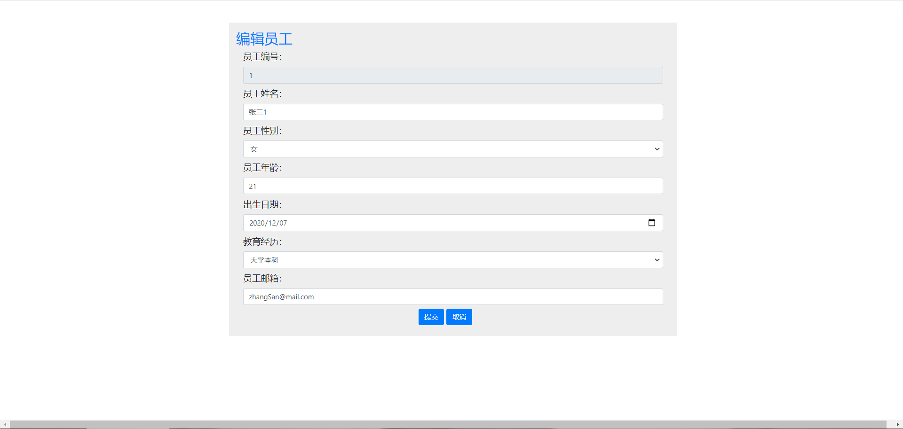


> 因为是restful风格的api，但是form表单只支持get和post请求，而我们修改是提交put请求，解决办法参考我的[另一篇文章](https://segmentfault.com/a/1190000038389511)，这里不再赘述。


修改页面，支持put请求

```html
<form th:action="@{/emp}" method="post" class="form" style="font-size: 20px;">
    <input name="_method" value="put" hidden>
```


输入框disabled属性会导致表单提交时，数据传不出去，后台拿到的empNo为null，所以我们改为如下：

```html
<input th:value="${employee.empNo}" readonly name="empNo" type="number" class="form-control" placeholder="请输入">

```


编写后台接口：

```java
@PutMapping("/emp")
    public String editEmp(Employee employee){
        //System.out.println(employee);

        empRepository.save(employee);

        return "redirect:/list";
    }
```


### 8、开发删除员工功能

> 思路：点击删除按钮，传员工id到后台，根据id删除
>
> 注意：因为a标签默认是get请求，而我们restful风格要提交delete请求，所以我们可以用ajax来改变提交方式，


修改前端页面：

```html
//取消a标签的默认行为
<a class="btn btn-danger" onclick="delEmp(this);return false;" th:href="@{/emp/}+${employee.empNo}" >删除</a>

//设置删除按钮的点击事件，改变提交方式
<script>
    function delEmp(node) {
        var url = node.href;
        $.ajax({
            url:url,
            type:'DELETE',
            success:function () {

            }
        });
        alert("删除成功！")
        window.location.reload();//完成删除后刷新浏览器
    }
</script>
```


编写后台删除接口

```java
@DeleteMapping("/emp/{empNo}")
public String delEmp(@PathVariable("empNo") Integer empNo){
    empRepository.deleteById(empNo);
    return "redirect:/list";
}
```


> 至此，我们已经完成了，基于jpa的restful风格的CRUD小demo！
>
> 不过还有诸多改进的地方，比如后端有许多重复代码可以进行封装、动态条件查询可以添加分页功能、页码数可以限制固定页数、增加联表、多表查询功能等等。

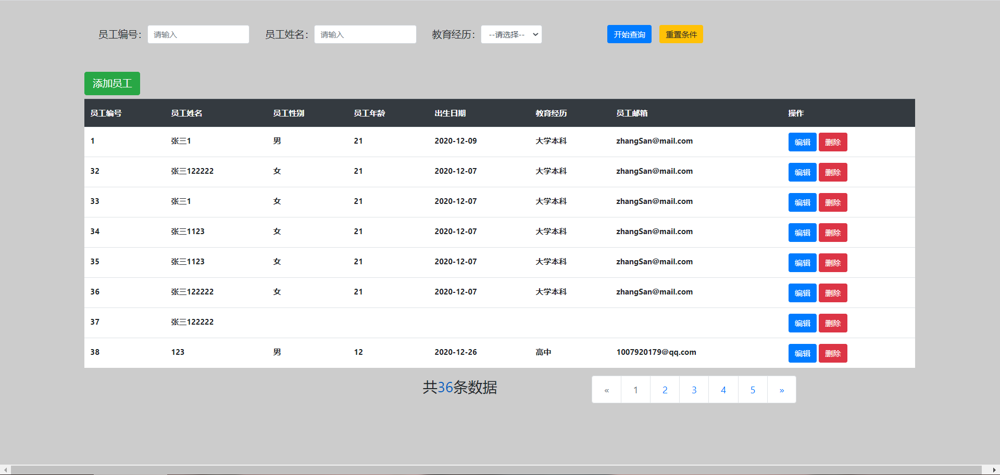